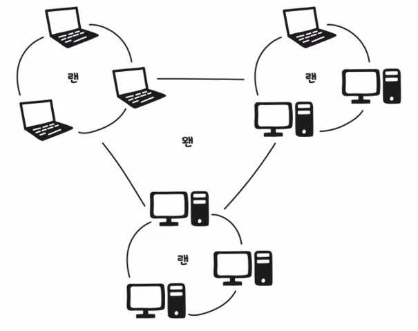

# :books: OSI 7계층 흐름 및 프로토콜

## 1. 네트워크 기본 개념

네트워크는 컴퓨터와 컴퓨터를 연결하여 데이터를 주고받을 수 있게하는 시스템으로 다음과 같은 3가지로 구성된다.

1. 컴퓨터
2. 전송 매체
3. 네트워크 장비

#### 컴퓨터

데이터 통신의 주체로 데이터를 이용해 무언가를 하기 위한 주체라는 뜻!

이런 측면에서 결국 네트워크가 하는 일은 애플리케이션이 만들어진 목적에 따른 무언가를 할 수 있도록 데이터를 주고받을 수 있는 환경을 제공하는 것이다.

#### 전송 매체

컴퓨터와 컴퓨터, 컴퓨터 사이에 위치한 네트워크 장비와 컴퓨터도 전송 매체에 의해 서로 연결된다. 데이터가 이동하는 물리적인 통로인 전송 매체는 크게 유선 전송 매체와 무선 전송 매체로 나눌 수 있음.

### LAN (Local Area Network)

건물 안이나 특정 지역을 범위로 하는 네트워크

- 주로 짧은 거리 내에 있는 컴퓨터나 주변 장치를 연결해 사용
- 좁은 의미로는 집에 노트북과 프린터만 연결해 사용하는 것도 랜
- 더 넓게는 하나의 건물 내에 존재하는 모든 컴퓨터와 주변 장치를 연결하는 것도 랜

#### LAN 종류

| 구분 | 스타형 | 링형 | 버스형 |
| --- | --- | --- | --- |
| 장점 | 확장하기 쉽다. | 초기 구성이 쉽다. | 비용이 저렴하면서 설치하기 쉽다. (일반적으로 많이 사용) |
| 단점 | 허브에서 문제가 발생하면 전체 통신이 안 왼다. | 컴퓨터를 한 대 더 추가할 경우 기존의 링을 절단하고 다시 연결해야 한다. | 케이블에 문제가 발생하면 전체 통신이 불가능하다. |

### WAN (Wide Area Network)

2개 이상의 랜을 연결한 것을 의미. 넓은 지역에서 광범위하게 통신하고자할 때 사용하는 네트워크를 뜻한다.

- WAN은 LAN과 다르게 광범위한 영역을 커버해야 하기 때문에 랜과 같은 별도의 네트워크 접속 형태는 없음
- 이미 랜에서 접속형태를 정의했으니 또다시 네트워크를 구성할 필요가 없기 때문
- 단지, 랜 사이에 통신이 잘 이루어지도록 연결만 해주면 됨!

---

## 2. 네트워크 장비

### Hub (허브)

네트워크 환경에서 여러 개의 기기를 서로 연결하는 역할을 하는 장치.

- 간단한 데이터 전달 기능을 제공하며, 주로 소규모 네트워크 환경에서 사용.
- 네트워크 내의 모든 기기에 동일한 데이터 전송 → 브로드캐스트
- 따라서, 스위치나 라우터 같은 고급 네트워크 장치에 비해 성능이 낮아, 현재는 잘 사용되지 않음

#### 원리와 기능

- 해당 데이터를 네트워크 내의 모든 기기에 전달
- OSI 모델의 물리 계층에서 작동. 허브는 데이터의 출발지와 목적지에 대한 정보를 알 수 없어, 네트워크 내의 모든 기기에 데이터 전송

### Switch (스위치)

네트워크 환경에서 여러 기기를 서로 연결하고, 효율적인 데이터 전송을 위한 역할을 수행하는 장치

- OSI 모델의 데이터 링크 계층(Layer 2)에서 작동하며, MAC 주소를 기반으로 데이터 전송
- 네트워크 내의 해당 기기에게만 데이터를 전송하여 효율성을 높이고, 데이터 충돌을 줄일 수 있음

### Router (라우터)

패킷의 위치를 추출하여, 그 위치에 대한 최적의 경로를 지정하며, 이 경로를 따라 데이터 패킷을 다음 장치로 전향시키는 장치.

- 이때 최적의 경로는 일반적으로는 가장 빠르게 통신이 가능한 경로
    - 최단 거리 일수도 있지만, 돌아가는 경로라도 고속의 전송로를 통해 전달이 되는 경로일수도 있다.

#### 정적 라우팅

관리자가 네트워크에 대한 경로 정보를 직접 지정하여 라우팅한다.

- 관리자에 의한 라우팅 정보만을 참조하여 라우터 자체 부담이 줄어들고 동적 라우팅보다 빠르며 안정적이다.
- 하지만, 네트워크 변화가 빈번하거나 등록할 네트워크 수가 많을 경우 경로 설정을 변경하기 어렵다.

#### 동적 라우팅

대규모 네트워크에 사용하며 라우터 간의 변경된 네트워크에 대한 정보를 자동으로 교환하여 라우팅한다.

- Routing Table을 자동으로 작성하여 관리자의 초기 설정만 필요하다.
- 그러나, 정적 라우팅보다 메모리를 많이 차지한다는 단점이 있다.

---

## 3. 데이터 전송 과정 및 기술

### 캡슐화와 역캡슐화

데이터에 헤더를 붙이고 아래 계층에 보내는 것을 캡슐화, 데이터에 헤더를 제거하고 위 계층에 보내는 것을 역캡슐화라 한다.

> 출처: https://gunjoon.tistory.com/15

위 그림을 보면 데이터 통신 시 상위 계층부터 캡슐화가 이루어지면서 데이터는 아래 계층으로 흘러간다. 데이터 수신 시 하위 계층부터 역캡슐화가 이뤄지면서 데이터는 상위 계층으로 흘러간다. 전송된 데이터는 패킷 단위로 라우터를 거쳐가므로 정확하게는 아래 그림처럼 흘러간다.

> 출처: https://gunjoon.tistory.com/15

### Trailer (트레일러)

트레일러는 다음과 같은 기능을 제공한다.

- 물리 계층에서 발생하는 에러를 검출하고 복구하는 체크섬(Checksum)
- CRC(Cyclic redundancy check) 등의 에러 제어 기능
- 과도한 데이터를 한 번에 전송하지 않도록 데이터의 양을 조절할 수 있는 동기화(synchronized)
- 흐름 제어 정보 등을 포함

---

## 4. 주요 네트워크 프로토콜

### ARP

네트워크 상에서 IP 주소를 물리적 주소로 대응시키기 위해 사용되는 프로토콜이다. 

- ARP는 LAN 통신 환경에서 데이터를 통신하기 위해 IP와 MAC을 이용하여 통신한다.
- ARP는 IP주소와 MAC 주소 둘다 필요하기 때문에 IP가 속해있는 네트워크 계층에서 사용되는 프로토콜이다.

#### ARP의 통신 과정

- ARP Request: 상대의 IP를 가지고 MAC 주소 정보를 요청하는 패킷
    - ARP Request는 LAN 구간의 모든 호스트에게 전달해야 되기 때문에 Brodcast(ff:ff:ff:ff:ff:ff) 통신을 한다.
    - ex) 나는 192.168.10.3인데, 192.168.10.3을 가진 호스트의 MAC 주소는 무엇인가
- ARP Reply: ARP Request를 받은 호스트가 해당 IP를 가지고 있으면 자신의 MAC 주소를 담아 응답하는 패킷
    - ARP Request를 요청한 호스트에게만 전달하면 되기 때문에, 해당 호스트에게 Unicast 통신으로 응답한다.
    - 자신의 IP와 다른 ARP Request를 받은 호스트들은 해당 패킷을 무시하고 해당 IP를 가진 호스트만 응답한다.

### CSMA/CD

LAN 통신 프로토콜의 종류 중 하나로 이더넷 환경에서 사용한다. 여러 대의 시스템이 동시에 통신을 하게 되면, 문제가 발생할 수 있는데, 이 부분을 처리하는 기술을 말한다.

충돌 감지 원리는 다음과 같다.

1. 보낸 사람은 케이블의 신호와 이력을 확인하고, 다른 사람에게 신호가 흐르고 있지않음을 확인 후 전송을 시작한다.
2. 전송 중에도 파형에 의해 다른 사람의 송신과 충돌하지 않는지를 감시하며, 만약 충돌하는 경우에는 일정량의 전송 후 중단하고 각 보낸 사람마다 일정 시간의 딜레이를 두고 전송을 재시작 한다.

### 브로드캐스트

로컬 네트워크에 연결되어 있는 모든 시스템에게 프레임을 보내는 방식을 말한다.

- ARP 프로토콜, 라우터끼리 정보를 교환 등에 사용된다.
- 과도한 브로드캐스트는 네트워크 상의 성능을 떨어뜨린다.

### 유니캐스트

네트워크 상에서 가장 많이 사용하는 통신 방식으로 통신을 받는 호스트의 주소를 프레임 안에 써넣는데 하나의 호스트를 넣어야 한다.

- 어떤 호스트가 유니캐스트 프레임을 뿌리게 되면 로컬 네트워크 상에 있는 모든 호스트들이 이 프레임을 받아들여 자신의 MAC 주소와 비교한다.
- 받은 MAC 주소와 자신의 MAC 주소가 다를 경우, 바로 그 프레임을 버린다.

### 멀티캐스트

보내고자 하는 그룹 멤버들에게만 한 번에 보낼 수 있는 방식을 말한다.

---

## 5. 인터넷 서비스 및 보안

### VPN (Virtual Private Network)

가상 사설망이라고 불리며, 인터넷과 같은 공중 네트워크를 마치 전용회선처럼 사용할 수 있게 해주는 기술 혹은 네트워크를 말한다. 공중망을 경유하여 데이터가 전송되더라도 외부인으로부터 안전하게 보호되도록 주소 및 라우터 체계의 비공개, 데이터 암호화, 사용자 인증 및 사용자 엑세스 권한 제한 등의 기능을 제공한다.

#### 구현 방식

VPN 구현을 위해 주로 다음과 같은 3가지 방식이 사용된다

- 방화벽 기반 VPN
    - 방화벽 장비에 VPN 기능 추가
    - 방화벽의 패킷 필터링 및 상태 기반 검사 기능을 활용하여 보안성을 높이나, 병목현상 발생 가능
    - 주로 소규모 기업에서 사용
- 라우터 기반 VPN
    - 라우터에 VPN 기능이 내장되어 있어 라우터를 통해 VPN 터널을 생성, 별도의 VPN 장비가 필요 없어 효율적
    - 보안 노출 문제 발생 가능
- 전용 VPN
    - 전용 VPN 장비를 사용하여 내부 네트워크 보안이 필요한 곳에 별도 설치하여 VPN 터널을 생성
    - 높은 보안성과 확정성을 제공하지만, 별도의 장비 구매 및 관리가 필요

### DHCP (Dynamic Host Configuration Protocol)

호스트의 IP주소와 각종 TCP/IP 프로토콜의 기본 설정을 클라이언트에게 자동적으로 제공해주는 프로토콜이다. 

- PC의 수가 많거나 PC 자체 변동사항이 많은 경우 IP 설정이 자동으로 되기 떄문에 효율적으로 사용 가능하고, IP를 자동으로 할당해주기 때문에 IP 충돌을 막을 수 있다.
- 그러나, DHCP 서버에 의존하기 때문에 서버가 다운되면 ip 할당이 제대로 이루어지지 않는다.

#### 동작 흐름 예시

1. 공유기에 노트북을 LAN으로 연결하면 자동으로 DHCP Client의 MAC 주소가 DHCP Server에게 IP 주소를 요청
2. DHCP Server는 DHCP Client에게 사용 가능한 IP를 자동으로 할당
3. 단, DHCP를 통해 할당 받은 IP 주소는 영구적인 것이 아님
4. 할당 받은 IP 주소를 사용하다가 임대 시간이 지나면 기간을 연장하거나 IP 주소를 반납
