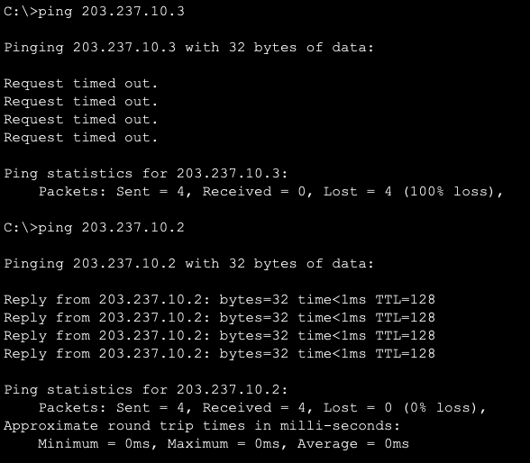

# :books: 이론 보충 및 실습

# 이론 보충

## 1. 서브넷 마스크란?

### 서브넷이란?

네트워크의 규모가 커질수록 네트워크를 관리하고 유지하기는 어려워진다. 네트워크가 작은 조각으로 쪼개져 있는 경우 이러한 조각을 서브넷이라고 부른다

→ 한 마디로 서브넷은 작은 네트워크!

이 때, 네트워크 성능 개선을 위해 네트워크 관리자가 효율적으로 자원을 분배하는 것을 서브네팅이라고 한다. 서브네팅은 다음과 같은 장단점을 갖는다.

-   관리하기 쉬움
-   고급 네트워크 보안
-   네트워크 트래픽 감소
-   네트워크 서브네팅 시 인터넷 서비스 업체(ISP)로부터 추가 IP 주소를 받을 필요가 없음
-   그러나, 추가 하드웨어가 필요한 경우가 있어 추가 비용이 들 수 있음

### 그래서 서브넷 마스크는?

32비트의 숫자로 0의 비트는 호스트 부분을 나타내고 1의 비트는 네트워크 부분을 나타낸다. 이러한 방식으로 서브넷 마스크는 IP 주소를 네트워크 및 호스트 주소와 분리한다. 다음과 같은 예시를 보자

서브넷 마스크는 255.255.255.0이다! 즉, 이를 IP 주소와 마스킹을 하면 다음과 같은 결과를 낳는다

-   네트워크 주소: 192.168.123.0 → AND 연산
-   호스트 주소: 0.0.0.132 → 서브넷 마스크를 NOT을 통해 반전하고 IP 주소와 AND 연산

---

## 2. VLAN이란?

쉽게 말하면 가상의 랜으로, 하나의 물리 스위치에서 여러 가지 네트워크를 사용할 수 있도록 하는 기술이다.

하나의 장비에 서로 다른 네트워크를 갖도록 논리적으로 분할했기 때문에, 유니캐스트, 브로드캐스트도 VLAN 간의 통신이 불가하며, VLAN 간의 통신이 필요하다면 서로 다른 네트워크 간의 통신이기 때문에 3계층 장비가 필요합니다. ex) 라우터

VLAN은 네트워크 분리와 트래픽 감소가 주된 목적으로 사용된다. 또한, 보안을 강화할 수 있으며, 유연성이 좋다

---

# 실습

## 1. LAN Topology Bus형

-   엔드 디바이스 ↔ 스위치: Copper Straight-Through로 연결
-   스위치 ↔ 스위치: Copper Cross-Over로 연결
-   엔드 디바이스의 IP 주소
    | 구분        | PC0           | Laptop0       | PC1           | Laptop1       |
    | ----------- | ------------- | ------------- | ------------- | ------------- |
    | IP          | 192.168.0.1   | 192.168.0.2   | 192.168.0.3   | 192.168.0.4   |
    | Subnet Mask | 255.255.255.0 | 255.255.255.0 | 255.255.255.0 | 255.255.255.0 |

### PC0 → Laptop1 연결 확인

## 2. VLAN

-   엔드 디바이스 IP 주소
    | 구분        | PC2           | Laptop2       | PC3           | Laptop3       |
    | ----------- | ------------- | ------------- | ------------- | ------------- |
    | IP          | 203.237.10.1  | 203.237.10.2  | 203.237.10.3  | 203.237.10.4  |
    | Subnet Mask | 255.255.255.0 | 255.255.255.0 | 255.255.255.0 | 255.255.255.0 |
    | 스위치 연결 | Fa0/1         | Fa0/2         | Fa0/3         | Fa0/4         |

### VLAN 설정

### PC2 → Laptop2 / PC2 → PC3 통신확인

VLAN 구성은 다음과 같다.

-   PC2 / Laptop2
-   PC3 / Laptop3

따라서 PC2 → Laptop2은 통신이 되고, PC2 → PC3는 통신이 안될 것을 예측할 수 있다.

## 3. Trunk (트렁크)

-   엔드 디바이스 IP 주소
    | 구분        | PC2           | Laptop2       | PC3           | Laptop3       | PC4           | PC5           |
    | ----------- | ------------- | ------------- | ------------- | ------------- | ------------- | ------------- |
    | IP          | 203.237.20.1  | 203.237.20.2  | 203.237.30.1  | 203.237.30.2  | 203.237.20.3  | 203.237.30.3  |
    | Subnet Mask | 255.255.255.0 | 255.255.255.0 | 255.255.255.0 | 255.255.255.0 | 255.255.255.0 | 255.255.255.0 |
    | 스위치 연결 | Fa0/1         | Fa0/2         | Fa0/3         | Fa0/4         | Fa0/1         | Fa0/2         |
-   스위치 간 연결 이더넷
    -   Switch4: Fa0/5
    -   Switch5: Fa0/3

### Switch5 VLAN 설정

Switch4의 경우 위의 VLAN 예제와 같음.

### PC2 → PC4 / PC2 → PC5 통신확인

원래였으면 trunk모드가 설정되어 있지 않아서 두 경우 모두 통신이 되지 않아야 하지만.

어쩐 일인지, 둘 다 통신이 되는 것을 확인할 수 있었다. 더 찾아보니

스위치의 trunk 모드가 auto로 되어 있어, 자동으로 적용되어 있어서 그런 것 같다…

## 4. inter-VLAN

-   엔드 디바이스 IP 주소
    | 구분            | PC2            | Laptop2        | PC3            | Laptop3        | PC4            | PC5            |
    | --------------- | -------------- | -------------- | -------------- | -------------- | -------------- | -------------- |
    | IP              | 203.237.20.1   | 203.237.20.2   | 203.237.30.1   | 203.237.30.2   | 203.237.20.3   | 203.237.30.3   |
    | Subnet Mask     | 255.255.255.0  | 255.255.255.0  | 255.255.255.0  | 255.255.255.0  | 255.255.255.0  | 255.255.255.0  |
    | Default Gateway | 203.237.20.254 | 203.237.20.254 | 203.237.30.254 | 203.237.30.254 | 203.237.20.254 | 203.237.30.254 |
    | 스위치 연결     | Fa0/1          | Fa0/2          | Fa0/3          | Fa0/4          | Fa0/1          | Fa0/2          |
-   스위치 간 연결 이더넷
    -   Switch4: Fa0/5
    -   Switch5: Fa0/3
-   라우터와 스위치 연결
    -   Switch5: Fa0/4
    -   Router0: Fa0/0

### Router0 서브 인터페이스

### PC2 → PC5 연결 확인

